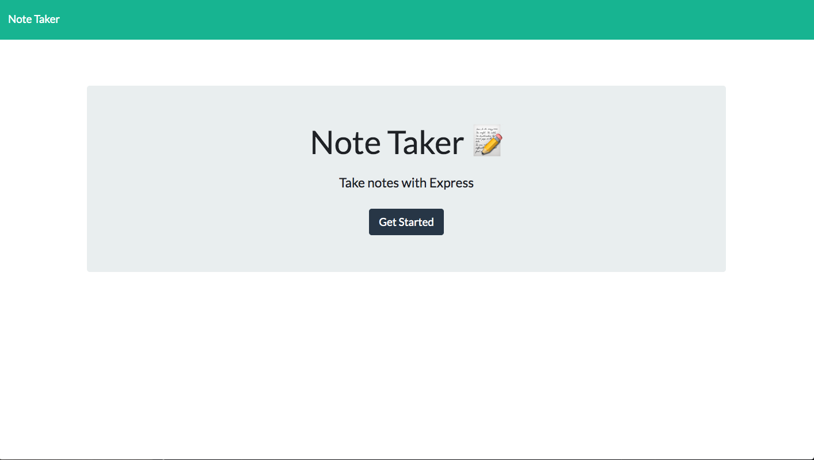
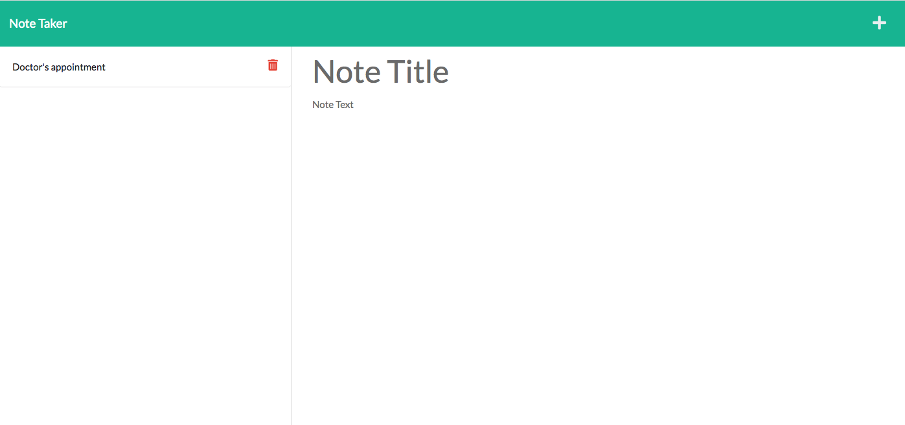

## Note Taker

## Description
For this project, we had to create a Note Taker using express.js, node.js, and Heroku. We have been provided with some starter code for the front end of the application and I was tasked with completing the back end of the code.

## Screenshot of the Live Note Taker Application

## Applications Used
1. Express
2. Node
3. Heroku

## Questions/Comments
jerrytrueba10@gmail.com

https://github.com/jerrytrueba